# PortfolioAnalyzer
Data Scraping from Yahoo! Finance

## Creating the scheduled task (in Windows only)

1. Create the scheduled task to launch your python script to gather data from Yaoo! Finance:
   1. Launch the Windows "Task Scheduler" app, for example:
      1. Windows Logo button + r --> taskschd.msc
      2. Windows Start menu --> type "Task Scheduler"
      3. Windows Logo button + x --> g  
         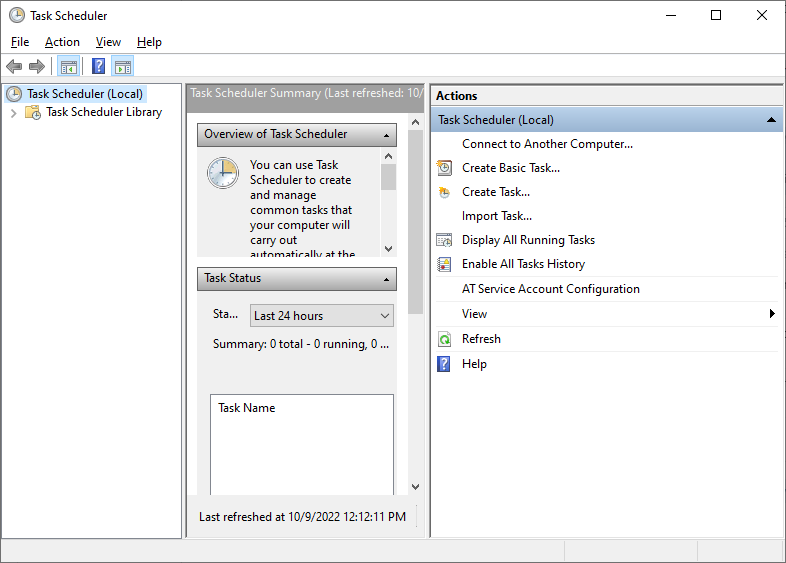
   2. If desired, create a new folder for your task(s)
      1. Click on the "Task Scheduler Library" menu item in the left navigator  
         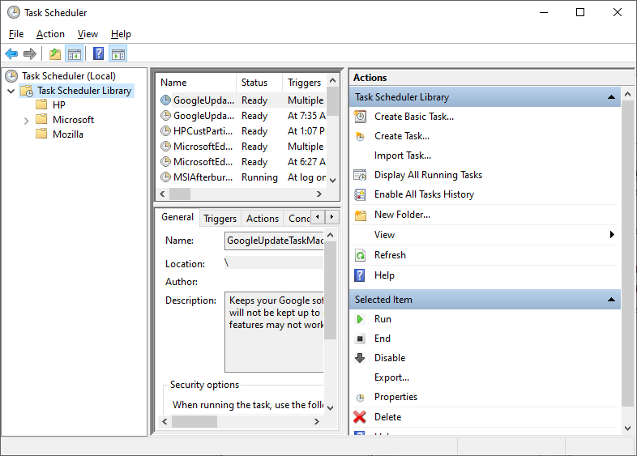
      2. Click on the "Task Scheduler Library" menu item in the left navigator and click on the "New Folder..." menu item on the right, then enter the name of the folder you wish to create  
         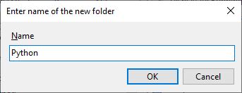
      3. The new folder is created  
         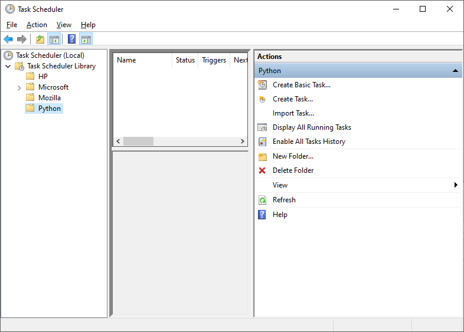
   3. With the folder where you wish to create your task selected, click on "Create Task" in the right menu  
      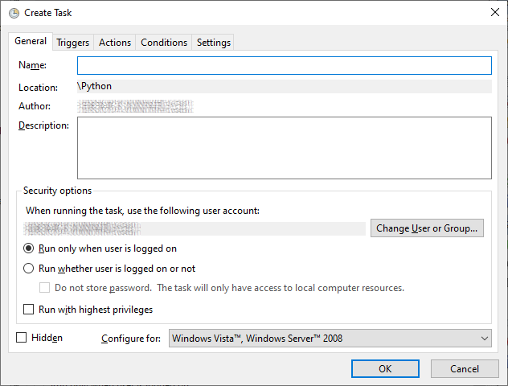
   4. Change the user who will be logging on from your name (by default) to "system" (click the "Check Names" button)  
      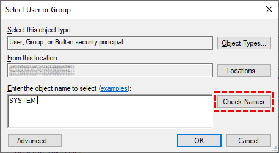
   5. Set all the other properties on the "General" tab as per the following. Note that you should keep the task's "Hidden" checkbox checked so that applications launched by the script will not be visible in the foreground - more on this later:  
      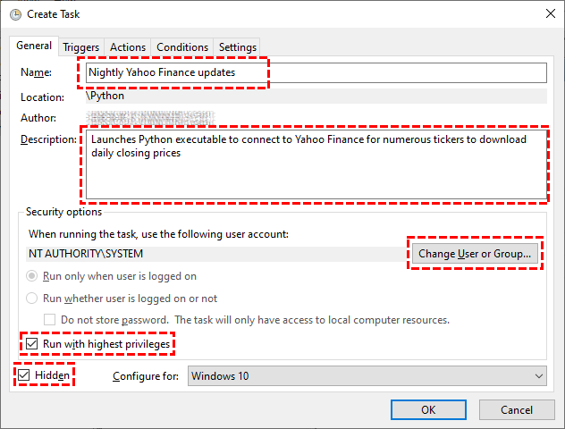
   6. Create a new Trigger from the "Triggers" tab as per the following:  
      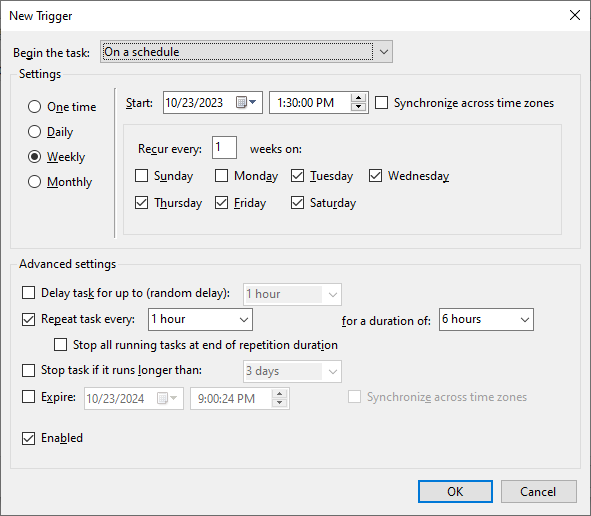
   7. Create a new Action from the "Actions" tab as per the following:
      - Make sure to set the path to your Python executable
      - Make sure to set the Argument textbox to the name of your script file (use double quotes if the script file has spaces), in this case `update_data_db.py`
      - Set the Start in text box to the folder that contains your Python script - that way all the files that are generated by this script will be maintained in the same folder  
        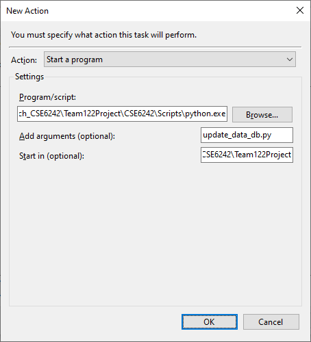
   8. When complete, make sure the Actions tab contains your preferences:  
      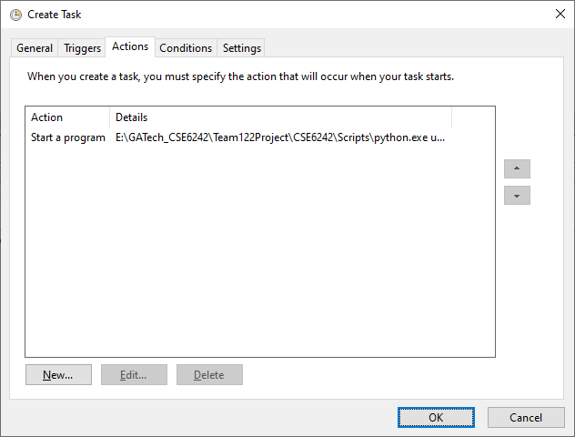
   9. You will probably want to update the "Conditions" tab as per the following, so that you don't have to wake up in the middle of the night to run your script:  
      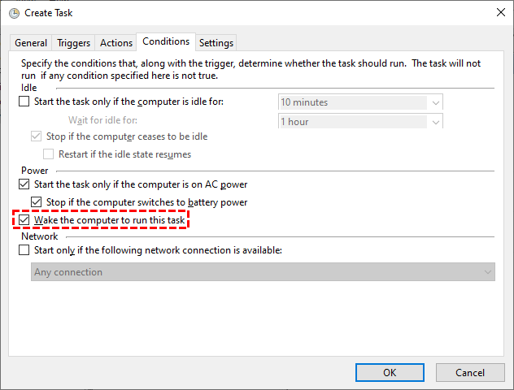
   10. There is probably nothing to update on the "Settings" tab:  
       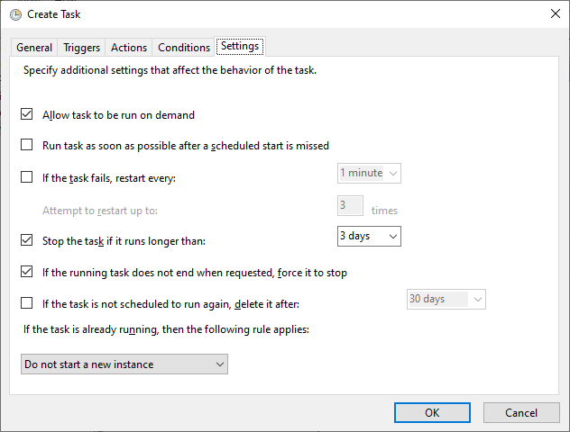
   11. Click the "OK" button and the taks will be created and scheduled to run:  
       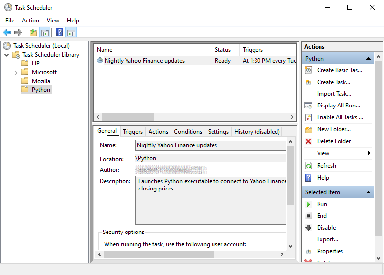
   12. Lastly, especially for initial debugging, you may want to enable the History for your Task Scheduler:  
       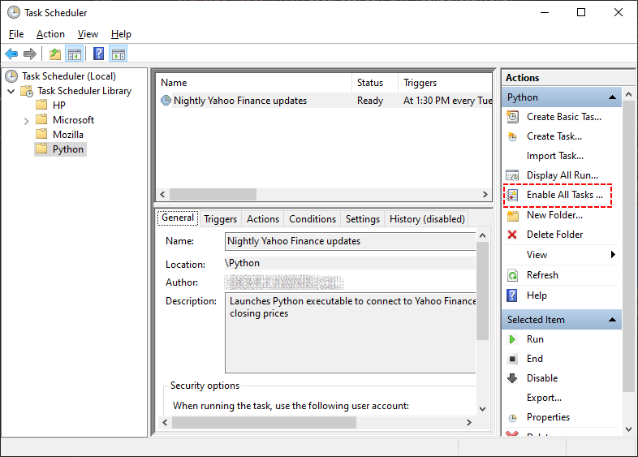  
       Doing so, allows you to also see the History in the Windows Event Viewer under the path `Event Viewer\Applications and Services\Microsoft\Windows\TaskScheduler\Operational`
2. At this point, everything is ready to begin checking if the environment has been correctly set up. If you've enabled the task to be run on demand, you can actualy launch the task now and then check to see if the task failed (under the History, or the Event Viewer), whether it produced any logging output, or populated the database.  
   If you get failures, often the problem is not having all the libraries `pip install`ed that are used in your Python script in the Python environment you specified, or possibly an issue with path names (recall that path names containing spaces must be double-quoted)